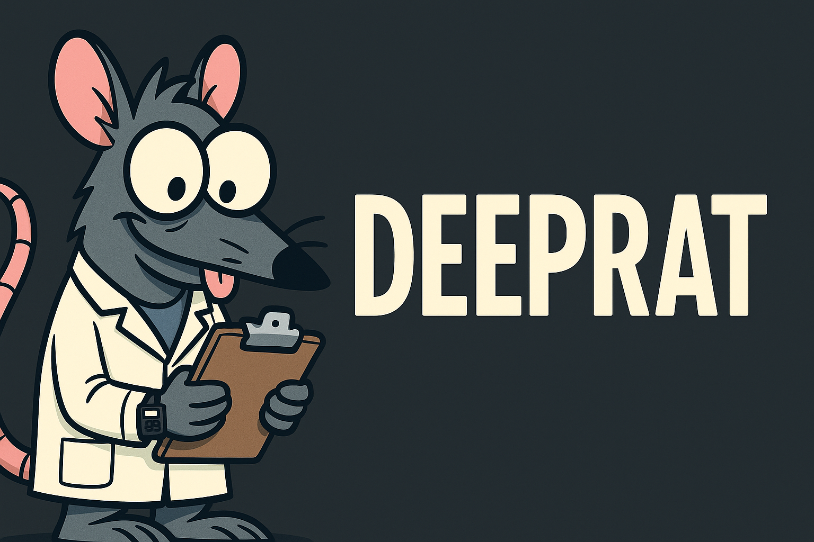
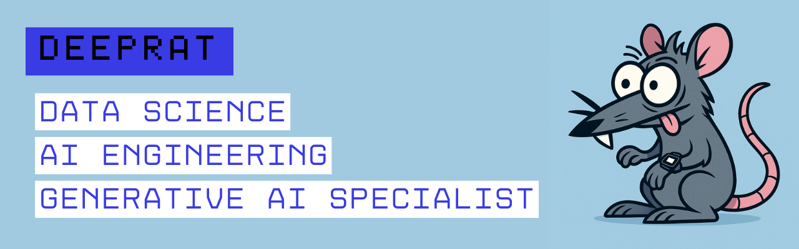

[](https://opensource.org/licenses/MIT)





# **RAGbotBenchmark\_Gcolab: Digging into Open-Source RAG Bots on Colab GPUs!** 🤖

Hey everyone! Gonzalo Romero here — a.k.a. Deeprat, benchmark gremlin and GPU squatter. I got curious about how some of these popular open-source LLMs actually behave in a real-world Retrieval-Augmented Generation (RAG) setup. You know RAG: you grab some relevant text based on a query, shove it next to the query in the LLM’s context, and hope it answers something coherent. Easy in theory, but what happens when we bring it into the chaotic, snack-fueled world of **Colab GPUs**?

Do quantized models really hold up on a dusty T4? Can Phi-2 go paw-to-paw with a heavyweight like LLaMA-2? Is the A100 worth selling your kidneys for? I didn’t want Reddit lore — I wanted **empirical data**. Real runs. Real prompts. Real lag. Let’s dig in.

---

## ⚙️ The Setup: What I Ran

**Basic RAG Pipeline:**

* SentenceTransformers (`all-MiniLM-L6-v2`) for embedding search — small, reliable, and blessed.
* Retrieved relevant chunks fed into the LLM with the query. Classic `[Context + Query]` formation.

**The Contenders:**

* `microsoft/phi-2` on **NVIDIA T4** — The agile little ratbot 🚀
* `meta-llama/Llama-2-7b-chat-hf` (4-bit quantized via bitsandbytes) on **T4** — The bodybuilder on a crash diet 💪
* `meta-llama/Llama-2-7b-chat-hf` (Full Precision - BF16/FP16) on **A100** — The luxury sedan of LLMs ✨

**The Arena:** Google Colab — the land of limited VRAM and infinite ambition 💻

**The Toolbox:** Hugging Face Transformers, Accelerate, bitsandbytes, PyTorch, SentenceTransformers, scikit-learn, UMAP, pandas.

---

## 📊 What I Looked For (Metrics & Analysis)

Each model got N=15 diverse prompts. For each run, I looked at:

* **Latency (Wall Clock Time):** How long does `.generate()` take? Can we chat or do we nap while it thinks? ⏱️
* **Semantic Quality (BERTScore F1):** Does the output *mean* what it’s supposed to mean? Scale 0–1 ✅
* **Lexical Overlap (ROUGE-L F1):** Do the words match up? Good for fluency + copy detection ✅
* **Output Embedding Geometry:** Where do the generated answer embeddings land in vector space? UMAP + KMeans magic 🗺️

> Check out the full analysis and plots in `Analysis_Report.ipynb` — it’s like CSI but with fewer fingerprints and more vector math.

---

## 💡 Key Findings / What Happened?

### 🔥 Speed: Hierarchy is Real, Quantization Isn’t Free

* **Phi-2/T4:** Blazing (\~2.1s avg). It’s like this model sips voltage.
* **LLaMA-2/A100:** Fast (\~3.5s avg) and *rock solid*. The A100 throws tensors like a dream.
* **LLaMA-2 Quant/T4:** Slow (\~10.1s avg). Quantization on a T4 is like ballet in a swamp.

### 🎯 Quality: Mixed Bag

* **LLaMA-2/A100:** High BERTScore, high ROUGE-L, low variance. A consistent overachiever 👑
* **Phi-2/T4:** Almost tied with LLaMA-2 on BERTScore (!), but wild ROUGE-L swings. Understands ideas, mumbles them out loud 🤔
* **LLaMA-2 Quant/T4:** Lower across the board. Speed and quality paid the quantization tax 📉

### 🧠 Embedding Space = Vibes

* **LLaMA-2/A100:** Answers formed a tight little UMAP ball — beautiful, terrifying.
* **Phi-2:** Answers scattered — a poet in chaos.
* **LLaMA-2 Quant/T4:** Clustered far from A100, hinting at representational drift due to quantization.

### 🧪 KMeans Finds Topics, Not Models

Tried KMeans (k=4). Turns out, answers cluster by *question topic*, not model. That’s MiniLM doing its job: prioritizing semantic closeness over stylistic nuance. Good for embeddings, bad for snark detection.

---

## ✅❌ So What? / Takeaways

* **No Free Lunch:** Great performance = great hardware. Quantization is clever, but it’s not wizardry.
* **Phi-2:** A fast, semantic powerhouse — but don’t expect Shakespeare.
* **LLaMA-2/A100:** Reliable quality if you’ve got the VRAM to flaunt.
* **LLaMA-2 Quant/T4:** Exists. Use when latency isn’t critical. Maybe for offline runs?
* **Benchmark Empirically:** Specs ≠ truth. Bench your actual use case or risk illusions.
* **Visuals Help:** UMAP + KMeans revealed behavior that raw metrics didn’t.

---

## 🛠 Try It Yourself! Let’s Tinker

This repo isn’t just for reading — it’s for experimenting.

1. Open any of the `benchmark_*.ipynb` notebooks:

   * `benchmark_phi2_T4.ipynb`
   * `benchmark_llama2_quant_T4.ipynb`
   * `benchmark_llama2_fp_A100.ipynb`
2. ⚠️ **Edit the CSV save path before you run!** Otherwise, you’ll overwrite past results. Name them like `results/benchmark_phi2_RUN_02.csv`
3. Run the notebook. Watch the GPU sweat.
4. Open `Analysis_Report.ipynb`, add your CSV to the loading cell (Cell 6), and rerun.
5. More data = more insight. Try N=100. See if KMeans starts finding model clusters. Compare prompt variations. Go deep.

> Break things. Fork stuff. Prompt recklessly. Deeprat encourages questionable but reproducible experimentation.

---

## 🤓 Nerd Corner: Observations & Speculation

### Quantization Latency

Bitsandbytes 4-bit quantization on T4s runs *slow*. Likely due to lack of native low-bit kernel support. My hunch: T4 spends time dequantizing weights for matmuls instead of using true low-bit ops. A100’s tensor cores fly with FP16/BF16.

### Embedding Geometry

LLaMA-2/A100 forms dense answer clusters = low variance. Phi-2 is spread = flexible phrasing. Quantized model shifts space entirely = style shift? Performance ≠ just accuracy — it's representational.

### KMeans Clusters = Topics

MiniLM dominates with semantic grouping. That’s why answers group by prompt topic, not by model. Style-level distinctions may need different embeddings or clustering methods.

### Phi-2 = Semantic Genius, Structural Mess

High BERTScore, volatile ROUGE. It *gets* what you're asking, just says it like a sleep-deprived poet.

### A100 = Consistency Engine

Raw compute + high-precision math = stable activations = consistent semantic embeddings. A virtuous loop.

---

## 📁 File Structure

```
Benchmark_ChatbotRAG/
├── Analysis_Report.ipynb
├── results/
│   ├── benchmark_results_phi2.csv
│   ├── benchmark_results_llama2_quant_t4.csv
│   └── benchmark_results_llama2_chat_a100.csv
├── benchmark_phi2_T4.ipynb
├── benchmark_llama2_quant_T4.ipynb
├── benchmark_llama2_fp_A100.ipynb
├── images/
├── .gitignore
└── README.md
```

---

## 🔧 Setup

```bash
git clone https://github.com/yourusername/Benchmark_ChatbotRAG.git
cd Benchmark_ChatbotRAG
pip install -r requirements.txt
# (Packages: pandas, numpy, matplotlib, seaborn, scikit-learn, sentence-transformers, torch, transformers, accelerate, bitsandbytes, umap-learn)
```

Fire up those notebooks. Feed your models. Let the chaos begin.

---

### License: MIT




> Deeprat Approved™
